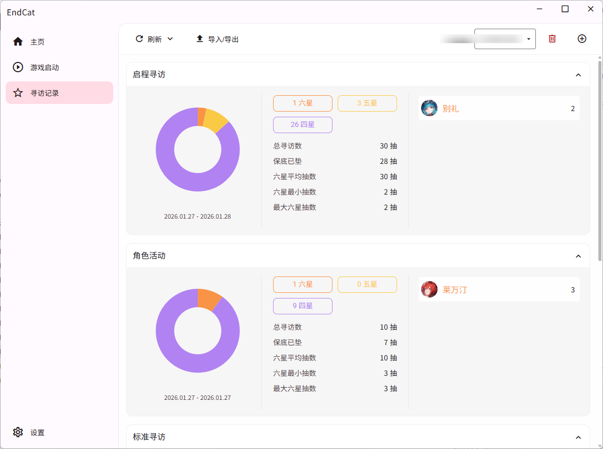

<p align="center">
  
</p>

<!-- Note: Image paths in docs/ might need adjustment if they are relative. Validated icon path above with ../ -->

<h1 align="center">EndCat</h1>

<p align="center">
  A modern, powerful game assistant for <strong>Arknights: Endfield</strong>.
</p>

<p align="center">
  <a href="../LICENSE">
    
  </a>
  
  
  
</p>

---

[简体中文](../README.md) | **English**

<p align="center">
  
</p>

## 📖 Introduction

**EndCat** is an unofficial, cross-platform game toolbox designed for *Arknights: Endfield*. Built with the latest web technologies and Rust, it provides a seamless experience for managing game data, analyzing gacha records, and more.

> **Note**: This project is currently in active development.

## ✨ Features

- **📊 Gacha Analysis**
  - Import/Export gacha records.
  - Visualize statistics: Pity counter, 6-star history, average pulls, and more.
  - Interactive charts powered by ECharts.
  - Local database storage (SQLite) for privacy and speed.

- **🗂️ Metadata Management**
  - Auto-fetch game data (images, text) from remote sources.
  - Support for multiple sources: GitHub (jsDelivr), Mirrors, or Custom CDN.
  - Smart caching and incremental updates.

- **🎨 Modern UI**
  - Built with **Varlet UI** (Material Design).
  - Fully responsive layout.
  - **Dark Mode** support / System theme sync.
  - Beautiful, dynamic background visuals.

- **🛠️ Tools (Planned)**
  - Game Launcher & Path Management.
  - Wiki / Strategy guides integration.

## 🛠️ Tech Stack

- **Core**: [Tauri v2](https://tauri.app) (Rust)
- **Frontend**: [Vue 3](https://vuejs.org) + [TypeScript](https://www.typescriptlang.org)
- **UI Framework**: [Varlet UI](https://varlet.gitee.io)
- **State Management**: [Pinia](https://pinia.vuejs.org)
- **Database**: SQLite (via `tauri-plugin-sql`)
- **Routing**: Vue Router
- **Build Tool**: Vite

## 🚀 Development

### Prerequisites
- Node.js (v18+)
- Rust (Latest stable)
- VS Code (Recommended)

### Setup

1. **Clone the repository**
   ```bash
   git clone https://github.com/BoxCatTeam/endfield-cat.git
   cd endfield-cat
   ```

2. **Install dependencies**
   ```bash
   npm install
   ```

3. **Run in development mode**
   ```bash
   npm run tauri dev
   ```

4. **Build for production**
   ```bash
   npm run tauri build
   ```

## 📄 License

This project is licensed under the **GPLv2 License**.
Copyright © 2026 [BoxCat](https://boxcat.org).

See [LICENSE](../LICENSE) for more information.

## ⚠️ Disclaimer

- This project is an unofficial tool and is not affiliated with **Hypergryph** or any of its affiliates or studios. All game assets and data are the intellectual property of their respective owners.
- The software is provided “as is” without any express or implied warranties (including, without limitation, availability, stability, accuracy, merchantability, or fitness for a particular purpose). You bear all risks and are solely responsible for any direct or indirect loss arising from its use.
- The software is for personal learning and research only. Commercial use, redistribution, or offering any value-added services is prohibited. Any liability arising from violation of these restrictions rests with the user.
- You must comply with applicable laws and regulations in your jurisdiction, as well as the relevant game/platform terms of service and intellectual property requirements. If you have any compliance or security concerns, stop using and uninstall the software immediately.
